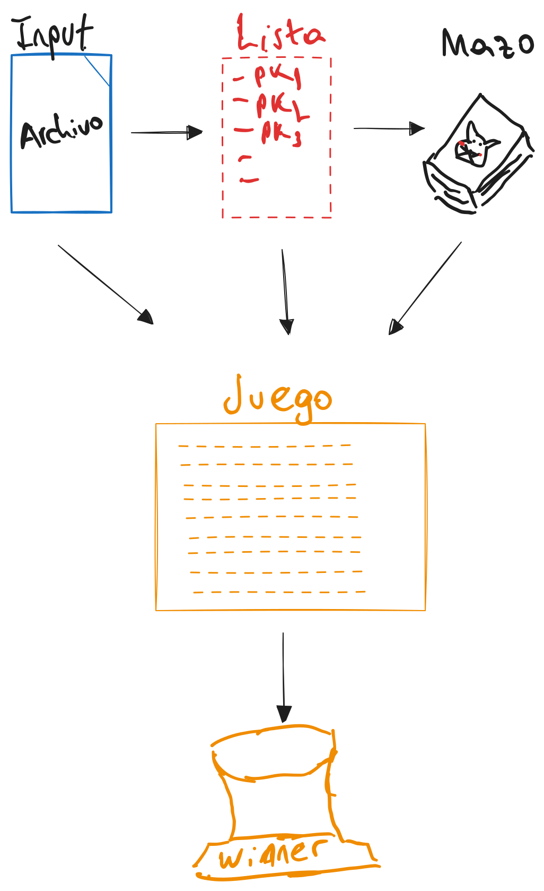
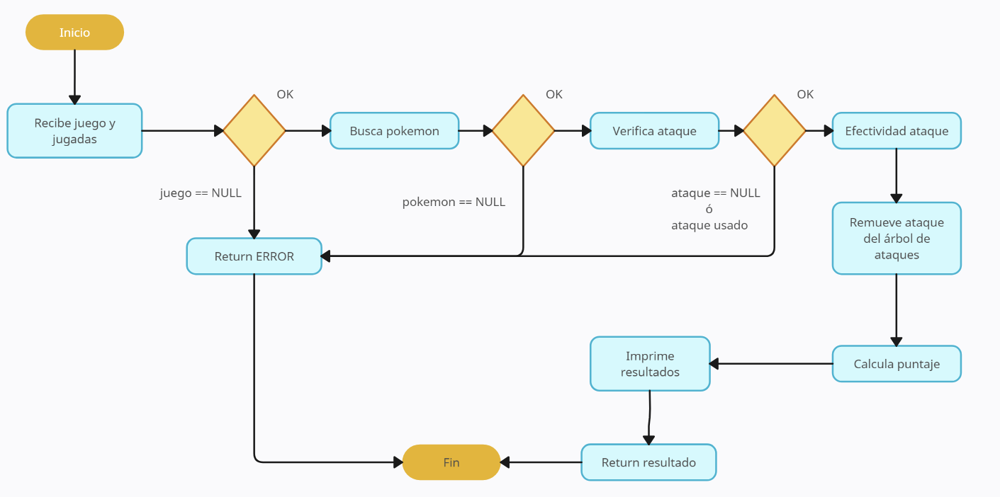

<div align="right">

</div>

# TP2

## Repositorio de (Lucas Aldonate) - (100030) - (laldonate@fi.uba.ar)

- Para compilar:

```bash
make main
```

- Para ejecutar:

```bash
./main
```

- Para ejecutar con valgrind:
```bash
make valgrind-main
```
---
##  Funcionamiento

El juego comienza pidiéndole al usuario un archivo (y validando que dicho archivo exista, si no existe, lo vuelve a pedir). Una vez obtenido el archivo, se cargan todos los pokemones, se crea el juego, el jugador, y el adversario (los 3 son TDAs), y se muestran por pantalla los pokemones disponibles, de los cuales se puede seleccionar 3 (sin repetir), por cada jugador. Se pide por consola al usuario que elija sus 3 pokemones (nuevamente validando que existan en la lista previamente mostrada y que no se repitan), luego el adversario elige sus 3 pokemones y se muestran por pantalla los pokemones que cada jugador va a usar a lo largo de la partida (el ultimo pokemon elegido por cada jugador le corresponde al contrincante).

Una vez definido el mazo de cada jugador, comienza un bucle de 9 turnos en donde se le solicitan por consola jugadas (nombre de pokemon y nombre de ataque) al usuario y dependiendo de lo que este elija y lo que el adversario elija se define un puntaje para cada turno, el jugador con mayor puntaje luego del noveno turno es el ganador.

<div align="center">

</div>

Una de las funciones principales del juego es `juego_jugar_turno`, es la función que se encarga de procesar las jugadas de ambos jugadores y determinar un resultado a lo largo de cada turno. Dicha función recibe un juego y dos jugadas, valida tanto que los pokemones existan y que los ataques estén disponibles, es decir, que existan y que no hayan sido utilizados previamente por el jugador. En caso de pasar todas las verificaciones, calcula el puntaje de cada jugador y muestra por pantalla el resultado del turno. A continuación, un diagrama para entender un poco más su funcionamiento:

<div align="center">

</div>

---

## Respuestas a las preguntas teóricas

### Respuesta 1

La lógica utilizada para el juego fue como se comenta arriba, un bucle un while a lo largo de toda la partida (9 turnos), donde mientras el juego no esté terminado se siga entrando a dicho while. En el juego existe un struct denominado `info_jugador` dentro del struct `juego`, que contiene el puntaje de cada jugador, un abb de ataques disponibles y un vector de ataques usados (con el fin de ir mostrándole al usuario los ataques que fue utilizando a lo largo de los turnos). También, dentro del struct `juego`, existe un entero `turno`, para determinar cuando finaliza la partida.

Se usaron validaciones para el jugador, tanto para el nombre del archivo, también para cuando el archivo no cumplía la cantidad mínima de pokemones requeridos (6 pokemones), validaciones a la hora de ingresar los pokemones que el pokemon quería utilizar en el juego (ver que existan en la lista de pokemones mostrada y que no se repitan en el mazo), a la hora de elegir pokemones y ataques para jugar el turno (ver que el pokemon exista en el mazo, que no haya utilizado todos sus ataques), lo mismo para el ataque (ver que exista en los ataques disponibles del jugador). 

En cuanto al adversario, se optó por utilizar numeros aleatorios para todas sus elecciones, en el caso de elegir los pokemones para su mazo, se randomizaba un índice teniendo en cuenta el tamaño de la lista de pokemones mostrada, y se iban seleccionando los pokemones para el mazo de esa manera (verificando que no los hubiera elegido ya para no tener duplicados). En cuanto a la elección de la jugada del adversario, se utilizó un numero random para elegir un pokemon al azar entre los 3 disponibles, y otro número random para seleccionar un ataque, en caso de que el ataque no correspondiera al pokemon, se volvía a aleatorizar el pokemon elegido hasta que corresponda con el ataque seleccionado previamente.

Las estructuras (que no se mencionaron arriba) utilizadas fueron las siguientes:

- Lista: principalmente por que se pide en el TDA `juego`, con el fin de lista los pokemones disponibles para seleccionar y agregar al mazo. Pero aparte, fue útil a la hora de utilizar el TDA `adversario`, para iterar la lista verificando si los ataques que elegia el adversario existían y en cada turno retirarlos de la lista.

- Jugador: fue útil tener un TDA `jugador`, que contenga las funciones necesarias para pedirle al usuario los datos necesarios para la realización del juego a lo largo de cada turno.

- Abb: su principal función fue contener los ataques del jugador y del adversario en el TDA `juego` con el mismo objetivo que tenía la lista en el TDA `adversario`, la diferencia es que en este caso no fue necesario randomizar elecciones (solo fue necesario para el adversario), por ende al no necesitar índices, se optó por el abb ya que tiene una complejidad algorítmica más chica que la lista (en este caso para la búsqueda se tiene que es O(log(n)) vs. a la hora de buscar los ataques elegidos aleatoriamente por el adversario, se puede llegar a una complejidad de O(n)).

### Respuesta 2

Todas las funciones de validación utilizan ciclos while, por ende su complejidad depende de la cantidad de intentos del usuario hasta concretar una elección valida (en el caso del adversario, depende de la cantidad de veces que tuvo que utilizar `rand` para cada elección).

Una función que vale la pena destacar es `juego_seleccionar_pokemon`: recibe el juego, un jugador, y los 3 nombres de pokemon que eligió. Por cada nombre busca si el pokemon está en la estructura `info_pokemon` (O(n) en el peor caso), luego agrega los ataques al árbol del jugador utilizando `con_cada_ataque` y pasándole `insertar_ataque` que a la vez usa `abb_insertar`(O(n) en el peor caso) (en este caso la cantidad de ataques es de 3 por pokemon, entonces O(3)) en cada pokemon. Finalmente se obtiene una complejidad e O(n).

El resto de las funciones utilizadas en su mayoria son O(n) ya que dependen de otros TDAs cuyas funciones suelen ser O(n).
